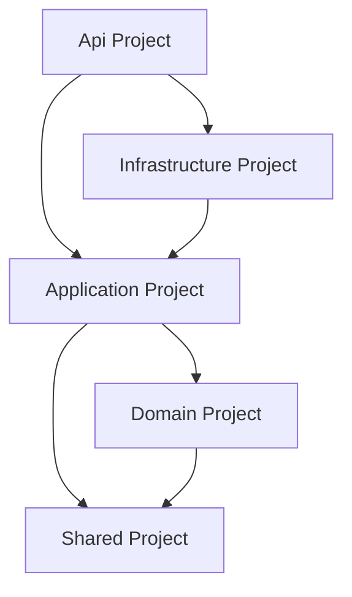

# SaaS .NET React Template — Clean Architecture Boilerplate

[](LICENSE)
[](https://dotnet.microsoft.com/)
[](https://reactjs.org/)
[](https://stripe.com/)
[](https://www.postgresql.org/)
[](https://scalar.com/)

---

**SaaS .NET React Template** is an enterprise-grade boilerplate designed for building scalable, secure, and production-ready Software-as-a-Service applications. By utilizing a decoupled **Clean Architecture** with **CQRS & MediatR** on .NET 9, along with a modern **Vite, React, TypeScript, and TailwindCSS** frontend, this boilerplate accelerates your time-to-market while enforcing software engineering best practices.

---

## Table of Contents

- [What's New in the .NET 9 Architecture Refactor](#whats-new-in-the-net-9-architecture-refactor)
- [Overview](#overview)
- [Key Features](#key-features)
- [Project Architecture Structure](#project-architecture-structure)
- [Dependencies & Tech Stack](#dependencies--tech-stack)
- [Basic Configuration & Environment Setup](#basic-configuration--environment-setup)
- [CQRS & MediatR Architecture Details](#cqrs--mediatr-architecture-details)
- [Security & Authentication](#security--authentication)
- [Database Auditing, Soft Delete & Conventions](#database-auditing-soft-delete--conventions)
- [Diagnostics & Troubleshooting](#diagnostics--troubleshooting)
- [Complete API Contract & Endpoints](#complete-api-contract--endpoints)
- [Testing Strategy](#testing-strategy)
- [Production Deployment & Database Migration Strategy](#production-deployment--database-migration-strategy)
- [Complete Checkout & Registration Workflows](#complete-checkout--registration-workflows)
- [Frontend Integration](#frontend-integration)
- [License](#license)
- [Contact](#contact)
- [Support](#support)

---

## What's New in the .NET 9 Architecture Refactor

This major release completely transitions the legacy codebase into an enterprise-grade Clean Architecture solution. Below are the key refactoring updates applied:

###  Security Refactoring

| Component | Legacy Smell | Solution & Refactoring |
|---|---|---|
| **JWT Generation** | Hardcoded secrets inside controllers | Extracted to [JwtProvider.cs](file:///c:/Users/Jorge/Desktop/C%23/SaaS-.NET-React-Template/src/Infrastructure/Authentication/JwtProvider.cs), using `IOptions<JwtSettings>` bound to secure environment variables. |
| **Password Cryptography** | Static helper inside UI/API layer | Extracted to [PasswordService.cs](file:///c:/Users/Jorge/Desktop/C%23/SaaS-.NET-React-Template/src/Infrastructure/Services/PasswordService.cs) implementing a clear `IPasswordHasher` abstraction inside the Application core. |
| **Controllers Logic** | Controller endpoints had direct database access | Controllers refactored into thin endpoints delegating all operations through MediatR commands. |

###  Architecture & Robustness Refactoring

| Component | Legacy Smell | Solution & Refactoring |
|---|---|---|
| **Database Operations** | Inline queries on `ApplicationDbContext` | Implemented Repository Pattern ([AppUserRepository.cs](file:///c:/Users/Jorge/Desktop/C%23/SaaS-.NET-React-Template/src/Infrastructure/Persistence/Repositories/AppUserRepository.cs)) and [UnitOfWork.cs](file:///c:/Users/Jorge/Desktop/C%23/SaaS-.NET-React-Template/src/Infrastructure/Persistence/Repositories/UnitOfWork.cs). |
| **Validation Flow** | manual checks inside controller actions | Created FluentValidation validators executing automatically via a MediatR [ValidationBehavior](file:///c:/Users/Jorge/Desktop/C%23/SaaS-.NET-React-Template/src/Application/Common/Behaviors/ValidationBehavior.cs) pipeline behavior. |
| **Error Format** | Raw strings or generic 500 errors | Configured [GlobalExceptionMiddleware](file:///c:/Users/Jorge/Desktop/C%23/SaaS-.NET-React-Template/src/Api/Middleware/GlobalExceptionMiddleware.cs) returning RFC 9457 compliant `ProblemDetails` for all uncaught/validation exceptions. |
| **Database Engine** | Hardcoded SQLite configuration | Transitioned to **PostgreSQL** with a global snake_case mapper and individual configurations implementing `IEntityTypeConfiguration<T>`. |

###  Developer Experience (DX)

- **Scalar API reference** replacing Swagger UI, accessible at `/scalar` and `/openapi/v1.json`.
- **OpenTelemetry** configuration monitoring traces and metrics for HTTP, AspNetCore, and EF Core.
- **Serilog** structured console logger with correlation IDs.
- **xUnit + Moq + WebApplicationFactory** testing suite verifying execution paths warning-free.

---

## Overview

The template separates technical concerns (Infrastructure, Web Api) from core business requirements (Domain, Application). It guarantees that code changes inside DB engines or external APIs (like Stripe) do not compromise or break core business logic.



---

## Key Features

###  Authentication & Identity
- **Decoupled Security**: Clean abstractions for hashing and JWT provider.
- **Token Claims**: Subject ID mapping along with emails.
- **JWT Middleware**: Standard validation parameters (signature validation, expiration checks, clock skew configuration).

###  Stripe Subscription Billing
- **Plans Configuration**: Ready features mapping for `Basic` and `Pro` tiers.
- **Audit Trails**: Automated updates of subscription start/end dates and Stripe customer mappings.
- **Stripe Integrations**: SDK references utilizing dependency injection to check stripe subscription status.

###  Developer Portal & API Management
- **API Key Generation**: Secure generation of base64-encoded api keys using `RandomNumberGenerator` with tracking dates.
- **Notification settings**: Fine-grained settings for comments, updates, and marketing emails.

###  Diagnostics & Quality Control
- **OpenTelemetry Instrumentation**: Distributed tracing and metrics dashboard.
- **Health Checks**: Database connectivity and container state checks exposed at `/health`.

---

## Project Architecture Structure

```text
SaaS-Template/
│
├── src/
│   ├── Domain/                         # Enterprise Domain Abstractions
│   │   ├── Common/                     # BaseEntity (Auditing/Soft-delete), IDomainEvent
│   │   ├── Entities/                   # AppUser, UserSettings, StripeCustomer, SubscriptionPlan
│   │   ├── Events/                     # UserRegisteredEvent, TrialStartedEvent
│   │   └── Repositories/               # Repository contracts (IAppUserRepository, etc.)
│   │
│   ├── Application/                    # Core Application Logic
│   │   ├── Common/Behaviors/           # ValidationBehavior pipeline
│   │   ├── Features/                   # CQRS Commands & Queries (Auth, Dashboard, Subscriptions)
│   │   └── Interfaces/                 # Ports (IJwtProvider, IPasswordHasher, ICurrentUserProvider)
│   │
│   ├── Infrastructure/                 # Technical Implementations
│   │   ├── Persistence/                # ApplicationDbContext, configurations, repositories, UnitOfWork
│   │   ├── Authentication/             # JwtProvider, CurrentUserProvider using HttpContext
│   │   └── Services/                   # PasswordService cryptography
│   │
│   ├── Api/                            # Presentation
│   │   ├── Controllers/                # AuthController, DashboardController, SubscriptionsController
│   │   ├── Middleware/                 # GlobalExceptionMiddleware (RFC 9457)
│   │   └── Program.cs                  # Startup and DI container configuration
│   │
│   └── Shared/                         # Domain-agnostic primitives
│       └── Result.cs                   # Result & Result<T> pattern wrapping errors
│
└── tests/
    ├── UnitTests/                      # xUnit/Moq tests for Commands and Validators
    └── IntegrationTests/               # API endpoint tests with WebApplicationFactory
```

---

## Dependencies & Tech Stack

### Project Packages

```xml
<!-- Api Project -->
<PackageReference Include="Microsoft.AspNetCore.Authentication.JwtBearer" Version="9.0.0" />
<PackageReference Include="Microsoft.AspNetCore.OpenApi" Version="9.0.0" />
<PackageReference Include="Microsoft.Extensions.Diagnostics.HealthChecks.EntityFrameworkCore" Version="9.0.0" />
<PackageReference Include="OpenTelemetry.Extensions.Hosting" Version="1.10.0" />
<PackageReference Include="OpenTelemetry.Instrumentation.AspNetCore" Version="1.10.0" />
<PackageReference Include="Scalar.AspNetCore" Version="2.0.9" />
<PackageReference Include="Serilog.AspNetCore" Version="9.0.0" />

<!-- Infrastructure Project -->
<PackageReference Include="Microsoft.EntityFrameworkCore" Version="9.0.0" />
<PackageReference Include="Npgsql.EntityFrameworkCore.PostgreSQL" Version="9.0.0" />
<PackageReference Include="OpenTelemetry.Instrumentation.EntityFrameworkCore" Version="1.10.0-beta.1" />
<PackageReference Include="Stripe.net" Version="44.5.0" />

<!-- Application Project -->
<PackageReference Include="FluentValidation.DependencyInjectionExtensions" Version="11.11.0" />
<PackageReference Include="MediatR" Version="12.4.1" />
```

---

## Basic Configuration & Environment Setup

### Environment Settings (`src/Api/appsettings.json`)

Configure JWT settings and your PostgreSQL database credentials:

```json
{
  "Serilog": {
    "MinimumLevel": {
      "Default": "Information",
      "Override": {
        "Microsoft": "Warning",
        "System": "Warning"
      }
    }
  },
  "ConnectionStrings": {
    "DefaultConnection": "Host=localhost;Database=saas_db;Username=postgres;Password=supersecretpassword"
  },
  "Jwt": {
    "Key": "your-super-secret-jwt-key-that-is-at-least-32-chars-long!!!"
  },
  "Stripe": {
    "SecretKey": "sk_test_your_stripe_secret_key_here",
    "WebhookSecret": "whsec_your_webhook_secret_here"
  },
  "AllowedHosts": "*"
}
```

### CLI Command Reference

Execute migrations or run testing suites from the root directory:

```bash
# Apply migrations to database
dotnet ef database update --project src/Infrastructure --startup-project src/Api

# Run Web API locally
dotnet run --project src/Api

# Run test suite
dotnet test SaaS.slnx
```

---

## CQRS & MediatR Architecture Details

Every controller action resolves to a Command (state-altering write) or Query (state-preserving read). Below is the execution structure:

```text
Request ──► Controller ──► MediatR Send() ──► [ ValidationBehavior ] ──► Handler ──► Database
```

### MediatR Validation Pipeline Behavior

Validators (e.g. `RegisterValidator`) run automatically before the Handler runs. If validation fails, `ValidationException` is thrown and handled globally:

```csharp
public class ValidationBehavior<TRequest, TResponse> : IPipelineBehavior<TRequest, TResponse>
    where TRequest : IRequest<TResponse>
{
    private readonly IEnumerable<IValidator<TRequest>> _validators;

    public ValidationBehavior(IEnumerable<IValidator<TRequest>> validators)
    {
        _validators = validators;
    }

    public async Task<TResponse> Handle(TRequest request, RequestHandlerDelegate<TResponse> next, CancellationToken cancellationToken)
    {
        if (!_validators.Any()) return await next();

        var context = new ValidationContext<TRequest>(request);
        var validationResults = await Task.WhenAll(_validators.Select(v => v.ValidateAsync(context, cancellationToken)));
        var failures = validationResults.SelectMany(r => r.Errors).Where(f => f != null).ToList();

        if (failures.Count != 0)
        {
            throw new ValidationException(failures);
        }

        return await next();
    }
}
```

---

## Security & Authentication

### Password Hashing (HMAC-SHA512)

We use custom HMAC-SHA512 salts for user credentials. The implementation is isolated behind the [IPasswordHasher](file:///c:/Users/Jorge/Desktop/C%23/SaaS-.NET-React-Template/src/Application/Interfaces/IPasswordHasher.cs) port:

```csharp
public class PasswordService : IPasswordHasher
{
    public (byte[] Hash, byte[] Salt) CreateHash(string password)
    {
        using var hmac = new HMACSHA512();
        return (hmac.ComputeHash(Encoding.UTF8.GetBytes(password)), hmac.Key);
    }

    public bool Verify(string password, byte[] hash, byte[] salt)
    {
        using var hmac = new HMACSHA512(salt);
        var computedHash = hmac.ComputeHash(Encoding.UTF8.GetBytes(password));
        return computedHash.SequenceEqual(hash);
    }
}
```

---

## Database Auditing, Soft Delete & Conventions

The DbContext dynamically modifies operations inside `SaveChangesAsync` to ensure consistent data compliance without polluting business logic:

### 1. Database Table Configurations
Applied independently via `IEntityTypeConfiguration<T>` implementations in [Configurations/](file:///c:/Users/Jorge/Desktop/C%23/SaaS-.NET-React-Template/src/Infrastructure/Persistence/Configurations). Table and columns are automatically mapped to lower_snake_case (e.g., table `app_users`, column `password_hash`).

### 2. Auto-Auditor
Captures metadata on insert and update:
- `created_at` (UTC) / `created_by` (Retrieved dynamically from claims via `ICurrentUserProvider`).
- `updated_at` (UTC) / `updated_by`.

### 3. Soft-Delete
Intercepts deletion requests. Instead of performing a hard SQL `DELETE`, EF Core executes an `UPDATE` operation setting `is_deleted = true`, `deleted_at = DateTime.UtcNow`, and `deleted_by`.
- **Query Filter**: Excludes deleted records from standard EF Core database reads globally:
```csharp
modelBuilder.Entity(entityType.ClrType).HasQueryFilter(e => !e.IsDeleted);
```

---

## Diagnostics & Troubleshooting

### OpenTelemetry setup
Configured inside [Program.cs](file:///c:/Users/Jorge/Desktop/C%23/SaaS-.NET-React-Template/src/Api/Program.cs) to track telemetry metrics:
```csharp
builder.Services.AddOpenTelemetry()
    .WithTracing(tracing => tracing
        .AddAspNetCoreInstrumentation()
        .AddHttpClientInstrumentation()
        .AddEntityFrameworkCoreInstrumentation())
    .WithMetrics(metrics => metrics
        .AddAspNetCoreInstrumentation()
        .AddHttpClientInstrumentation());
```

### Global Problem Details Handler
Unhandled application errors and validation failures are formatted to RFC 9457 Problem Details responses:

```json
{
  "type": "https://tools.ietf.org/html/rfc9110#section-15.5.1",
  "title": "One or more validation errors occurred.",
  "status": 400,
  "detail": "See the errors property for more details.",
  "errors": {
    "Email": ["'Email' is not a valid email address."]
  }
}
```

---

## Complete API Contract & Endpoints

### Endpoint Mapping

| Path | Verb | Payload (Body) | Successful Response (200 OK) | Error Codes |
|---|---|---|---|---|
| `/api/auth/register` | `POST` | `RegisterCommand` | `{ "message": "User registered" }` | 400 Bad Request |
| `/api/auth/login` | `POST` | `LoginCommand` | `{ "token": "<jwt_string>" }` | 401 Unauthorized |
| `/api/dashboard/profile` | `GET` | *None* | `ProfileDto` | 404 Not Found |
| `/api/dashboard/profile` | `PUT` | `UpdateProfileRequest` | `{ "message": "Profile updated" }` | 400, 404 |
| `/api/dashboard/settings` | `GET` | *None* | `SettingsDto` | 404 (with hasKey: false) |
| `/api/dashboard/settings` | `POST` | `UpdateSettingsRequest` | `{ "message": "Settings updated" }` | 404 |
| `/api/dashboard/generate-api-key` | `POST` | *None* | `{ "message": "API key generated", "apiKey": "<key>" }` | 404 |
| `/api/dashboard/subscription-plans` | `GET` | *None* | `List<SubscriptionPlanDto>` | *None* |
| `/api/dashboard/start-trial` | `POST` | *None* | `{ "message": "Trial started" }` | 400, 404 |
| `/api/subscriptions` | `GET` | *None* | `SubscriptionDto` | *None* |
| `/health` | `GET` | *None* | `200 OK` (Health status) | 503 Service Unhealthy |

---

## Testing Strategy

The test suite is structured to perform isolated unit testing on logic behaviors, alongside full API contract testing:

###  Unit Tests (`tests/UnitTests`)
- Uses **xUnit** and **Moq** to test handlers and validators.
- Validates boundary checks for user registration, duplicate emails, password validation, and settings configurations.

###  Integration Tests (`tests/IntegrationTests`)
- Uses `WebApplicationFactory<Program>` to test HTTP pipelines.
- Overrides Npgsql registrations with an InMemory Database for testing.
- **Shared Provider**: Leverages a static `IServiceProvider` to share database states across scoped requests (register and immediately logging in checks).

---

## Complete Checkout & Registration Workflows

### Checkout Flow Diagram

```
User                      Frontend                   Backend                     Stripe
 │                           │                          │                           │
 ├─────── 1. Register ──────►│                          │                           │
 │                           ├────── 2. POST Register ─►│  [Create UserSettings]    │
 │                           │◄───── 200 OK ────────────┤  UserRegisteredEvent      │
 │                           │                          │                           │
 ├─────── 3. Login ─────────►│                          │                           │
 │                           ├────── 4. POST Login ────►│                           │
 │                           │◄───── 200 Token ─────────┤                           │
 │                           │                          │                           │
 ├─────── 5. Start Trial ───►│                          │                           │
 │                           ├────── 6. POST Trial ────►│  [Set Trial Dates]        │
 │                           │◄───── 200 OK ────────────┤  TrialStartedEvent        │
 │                           │                          │                           │
 ├─────── 7. Subscription ──►│                          │                           │
 │                           ├────── 8. GET Sub ───────►│                           │
 │                           │◄───── 200 Sub info ──────┤─── 9. Read Customer ─────►│
```

---

## Frontend Integration

The React frontend (located in `/frontend`) is configured to connect to the refactored endpoints. Make sure to set the correct URL parameter inside your frontend environment settings (`frontend/.env`):

```env
VITE_API_URL=http://localhost:5000/api
```

The application's profile management, checkout redirects, trial triggers, and notification forms will align with the refactored endpoints.

---

## License

Licensed under the **MIT License**. See [LICENSE](LICENSE) for details.

---

## Contact

Author: **Jorge Gaspar Beltre Rivera**  
Project: **SaaS .NET React Template**

 [](https://github.com/JorgeGBeltre)
 [](https://www.linkedin.com/in/jorge-gaspar-beltre-rivera/)
 [](mailto:Jorgegaspar3021@gmail.com)

---

##  Support

This project is developed independently.

Even a small contribution helps me dedicate more time to development, testing, and releasing new features.

 [](https://www.paypal.com/donate/?hosted_button_id=2VLA8BWT967LU)
