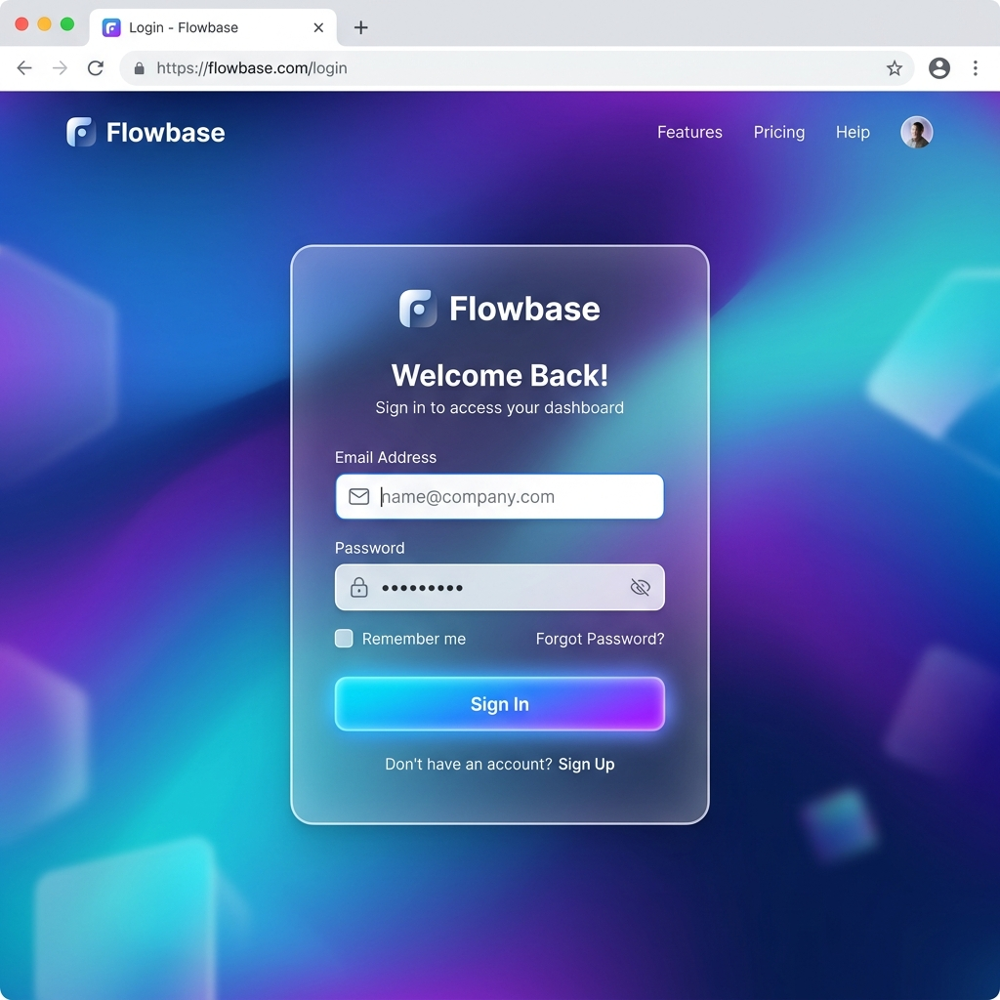
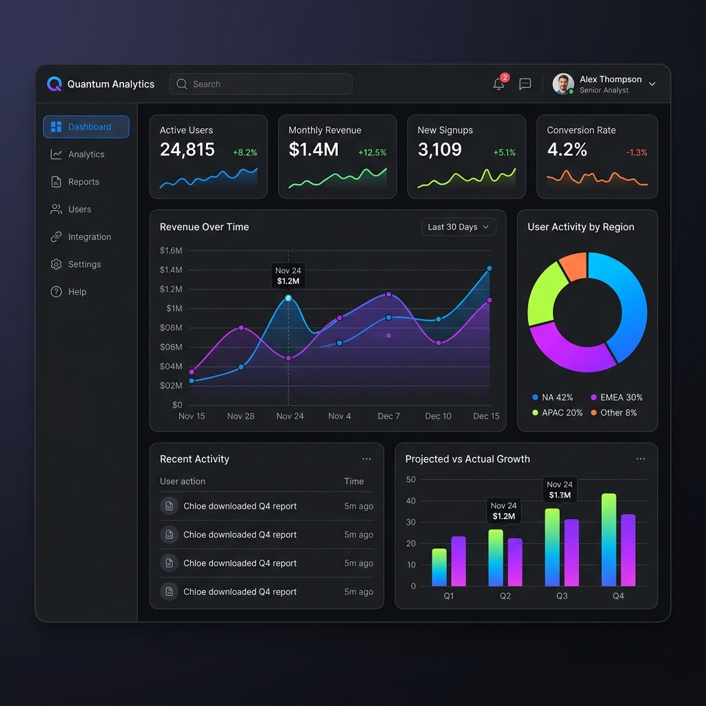

# SaaS .NET React Template

[](https://opensource.org/licenses/MIT)
[](https://dotnet.microsoft.com/)
[](https://reactjs.org/)
[](https://stripe.com/)
[](https://tailwindcss.com/)

A **premium, production-ready SaaS boilerplate** designed to accelerate your development process. This template combines the performance of **.NET 8** with the flexibility of **React 18** and **TypeScript**, providing a robust foundation for building scalable software-as-a-service applications.

> **Note:** This is a comprehensive template including Authentication, Dashboard, Stripe Subscriptions, and API Key Management.

---

## Screenshots

<div align="center">
  
  &nbsp;
  
</div>

---
## Table of Contents

- [Key Features](#-key-features)
  - [Authentication & Security](#authentication--security)
  - [Subscription Management](#subscription-management)
  - [Modern Dashboard](#modern-dashboard)
  - [Developer Experience](#developer-experience)
- [Tech Stack](#-tech-stack)
- [Project Structure](#-project-structure)
- [Quick Start](#-quick-start)
  - [Prerequisites](#prerequisites)
  - [1. Clone the repository](#1-clone-the-repository)
  - [2. Backend Configuration](#2-backend-configuration)
  - [3. Frontend Configuration](#3-frontend-configuration)
- [API Endpoints Summary](#-api-endpoints-summary)
- [Environment Variables](#-environment-variables)
  - [Backend (appsettings.json)](#backend-appsettingsjson)
  - [Frontend (.env)](#frontend-env)
- [Deployment](#-deployment)
- [Contributing](#-contributing)
- [License](#-license)
- [Contact](#-contact)
- [Support](#-support)

---
##  Key Features

###  Authentication & Security
- **JWT Authentication**: Secure login and registration flow.
- **Role-Based Access**: Infrastructure ready for multi-tenant or role-based logic.
- **Secure API**: Protected endpoints using industry-standard JWT tokens.

###  Subscription Management
- **Stripe Integration**: Fully integrated subscription flow with trial periods.
- **Webhook Ready**: Backend pre-configured to handle Stripe webhooks for real-time subscription updates.
- **Plans & Pricing**: Dynamic pricing page and checkout session handling.

###  Modern Dashboard
- **User Profile**: Management of user details and preferences.
- **API Key Management**: Allow users to generate and manage their own API keys for your service.
- **Responsive Layout**: Sleek, mobile-first design using TailwindCSS and modern typography.

###  Developer Experience
- **Vite + TypeScript**: Ultra-fast frontend development and type safety.
- **EF Core + SQLite**: Ready-to-use database setup with easy migration paths to PostgreSQL or SQL Server.
- **Swagger Documentation**: Interactive API testing playground available out-of-the-box.

---

##  Tech Stack

| Layer | Technology |
| :--- | :--- |
| **Frontend** | React 18, TypeScript, Vite, TailwindCSS, React Router |
| **Backend** | .NET 8 Web API, Entity Framework Core |
| **Database** | SQLite (Default), Support for PostgreSQL / SQL Server |
| **Auth** | JWT (JSON Web Tokens) |
| **Payments** | Stripe (Subscriptions & Webhooks) |
| **API Docs** | Swagger (OpenAPI) |

---

##  Project Structure

```text
saas-dotnet-react/
├── Backend/                 # .NET 8 Web API
│   ├── Controllers/         # API Endpoints (Auth, Dashboard, Subscriptions)
│   ├── Data/                # DbContext & Database Configuration
│   ├── Migrations/          # EF Core Migrations
│   ├── Models/              # Domain Entities & DTOs
│   ├── Services/            # Business Logic & Third-party Integrations
│   └── Program.cs           # Application Bootstrapper
│
├── frontend/                # React Vite Application
│   ├── src/
│   │   ├── components/      # Shared UI Components (Nav, Sidebar)
│   │   ├── hooks/           # Custom React Hooks (useAuth)
│   │   ├── pages/           # Application Views (Auth, Dashboard, Landing)
│   │   └── App.tsx          # Main Routing Logic
│   └── tailwind.config.js   # Styling Configuration
└── README.md                # Project Documentation
```

---

##  Quick Start

### Prerequisites
- [.NET 8 SDK](https://dotnet.microsoft.com/download)
- [Node.js 18+](https://nodejs.org/)
- [Stripe CLI](https://stripe.com/docs/stripe-cli) (for local webhook testing)

### 1. Clone the repository
```bash
git clone https://github.com/JorgeGBeltre/SaaS-.NET-React-Template.git
cd SaaS-.NET-React-Template
```

### 2. Backend Configuration
1. Navigate to the backend folder:
   ```bash
   cd Backend
   ```
2. Restore dependencies and update the database:
   ```bash
   dotnet restore
   dotnet ef database update
   ```
3. Run the API:
   ```bash
   dotnet run
   ```
   *The API will be available at `http://localhost:5000` (Swagger: `/swagger`)*

### 3. Frontend Configuration
1. Navigate to the frontend folder:
   ```bash
   cd ../frontend
   ```
2. Install dependencies:
   ```bash
   npm install
   ```
3. Start the development server:
   ```bash
   npm run dev
   ```
   *The application will be available at `http://localhost:5173`*

---

##  API Endpoints Summary

| Method | Endpoint | Description |
| :--- | :--- | :--- |
| `POST` | `/api/auth/register` | User Registration |
| `POST` | `/api/auth/login` | User Authentication |
| `GET` | `/api/dashboard/settings` | Retrieve user preferences |
| `POST` | `/api/dashboard/generate-api-key` | Create a new API Key |
| `POST` | `/api/subscriptions/create-checkout` | Initialize Stripe Checkout |
| `GET` | `/api/subscriptions/status` | Check subscription validity |

---

##  Environment Variables

### Backend (`appsettings.json`)
```json
{
  "Jwt": {
    "Key": "YOUR_SECRET_KEY_HERE"
  },
  "Stripe": {
    "SecretKey": "sk_test_...",
    "WebhookSecret": "whsec_..."
  }
}
```

### Frontend (`.env`)
```env
VITE_API_URL=http://localhost:5000/api
VITE_STRIPE_PUBLIC_KEY=pk_test_...
```

---

##  Deployment

1. **Backend**: Host on Azure App Service, AWS Elastic Beanstalk, or any VPS. Set `ASPNETCORE_ENVIRONMENT` to `Production`.
2. **Frontend**: Deploy `dist/` folder to Vercel, Netlify, or AWS S3.
3. **Database**: Switch from SQLite to PostgreSQL for production environments.

---

##  Contributing

Contributions are what make the open-source community such an amazing place to learn, inspire, and create. Any contributions you make are **greatly appreciated**.

1. Fork the Project
2. Create your Feature Branch (`git checkout -b feature/AmazingFeature`)
3. Commit your Changes (`git commit -m 'Add some AmazingFeature'`)
4. Push to the Branch (`git push origin feature/AmazingFeature`)
5. Open a Pull Request

---

##  License

This project is licensed under the MIT License – see the [LICENSE](LICENSE) file for details.

---

## Contact

Author: **Jorge Gaspar Beltre Rivera**  
Project: **SaaS .NET React**

[](https://github.com/JorgeGBeltre)
[](https://www.linkedin.com/in/jorge-gaspar-beltre-rivera/)
[](mailto:Jorgegaspar3021@gmail.com)

Project Link: [https://github.com/JorgeGBeltre/SaaS-.NET-React-Template](https://github.com/JorgeGBeltre/SaaS-.NET-React-Template)

---

##  Support

This project is developed independently. If you find it useful, consider supporting its development!

[](https://www.paypal.com/donate/?hosted_button_id=2VLA8BWT967LU)
