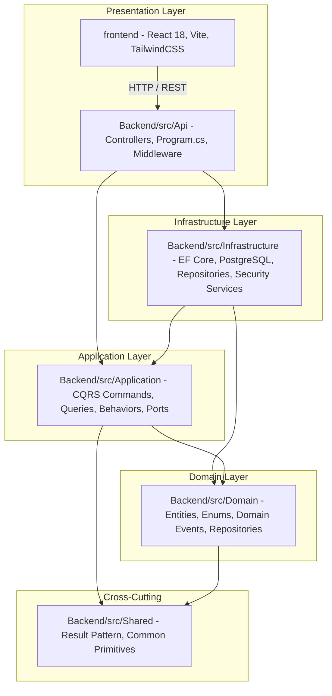
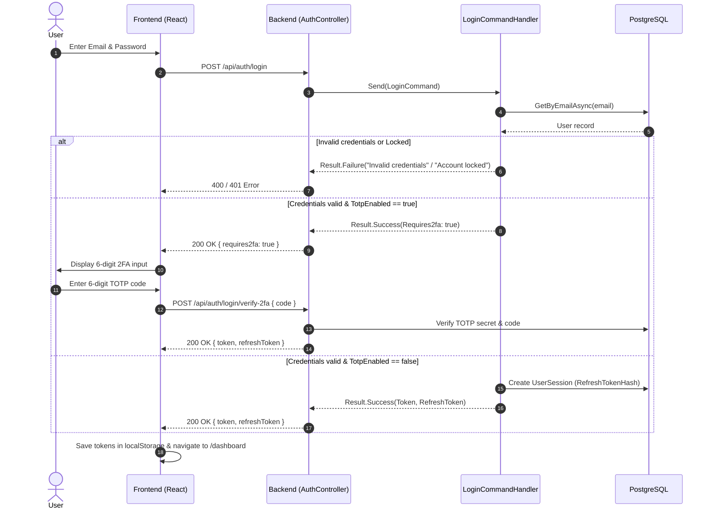
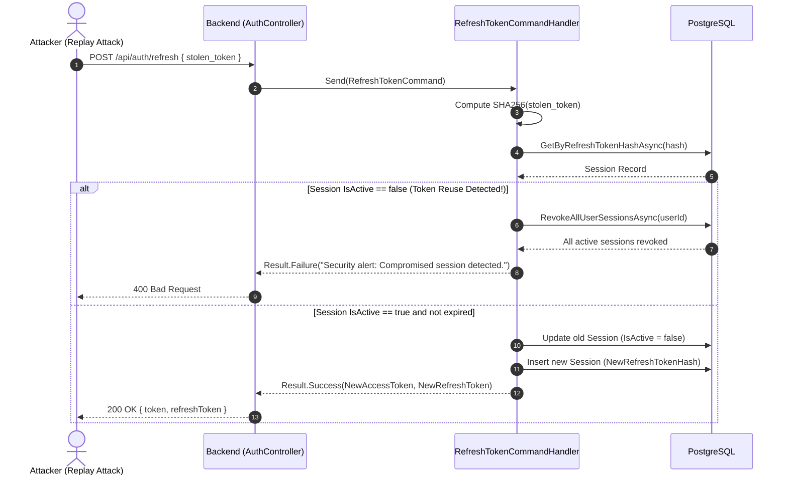
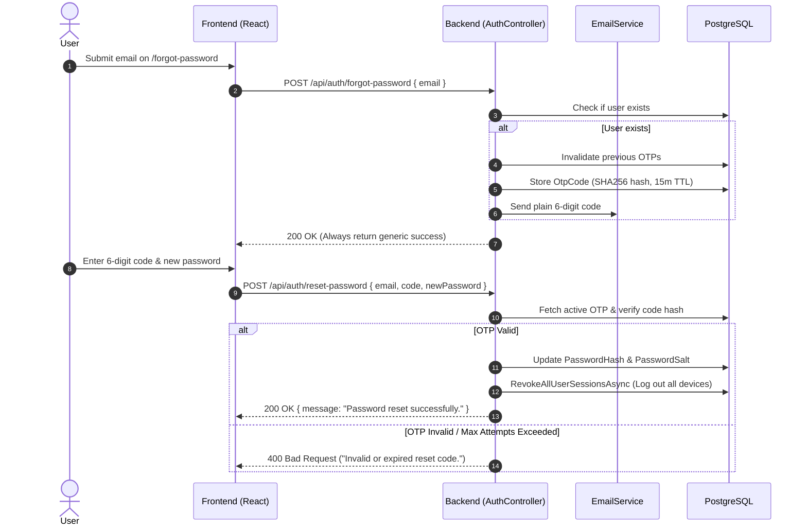
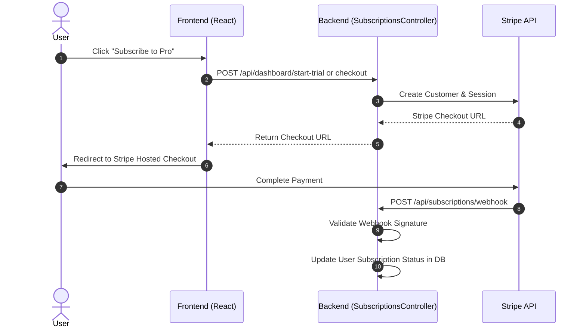

# SaaS .NET React Template — Clean Architecture & Bank-Grade Security Boilerplate

[](LICENSE)
[](https://dotnet.microsoft.com/)
[](https://reactjs.org/)
[](https://www.postgresql.org/)
[](https://stripe.com/)
[](https://scalar.com/)
[](https://www.docker.com/)

---

**SaaS .NET React Template** is an enterprise-grade boilerplate designed for building scalable, secure, and production-ready Software-as-a-Service applications. It features a decoupled **Clean Architecture** with **CQRS & MediatR** on **.NET 9**, an advanced **Bank-Grade Authentication & Security Ecosystem** (account lockout, RFC 6819 token reuse detection, OTP verification, TOTP 2FA, OAuth2 Google), and a modern **Vite, React 18, TypeScript, and TailwindCSS** frontend.

---

## Table of Contents

- [Overview & Architecture](#overview--architecture)
- [Key Features](#key-features)
- [Project Directory Structure](#project-directory-structure)
- [Tech Stack & Dependencies](#tech-stack--dependencies)
- [Security & Authentication Engine](#security--authentication-engine)
- [Architectural Flow Diagrams](#architectural-flow-diagrams)
  - [1. Authentication & 2FA Flow](#1-authentication--2fa-flow)
  - [2. Refresh Token Rotation & RFC 6819 Theft Detection](#2-refresh-token-rotation--rfc-6819-theft-detection)
  - [3. Password Reset via Secure OTP Flow](#3-password-reset-via-secure-otp-flow)
  - [4. Subscription & Stripe Checkout Flow](#4-subscription--stripe-checkout-flow)
- [Step-by-Step Reproduction & Setup Guide](#step-by-step-reproduction--setup-guide)
  - [Prerequisites](#prerequisites)
  - [Method 1: Quickstart with Docker Compose (Recommended)](#method-1-quickstart-with-docker-compose-recommended)
  - [Method 2: Local Development Setup](#method-2-local-development-setup)
- [Configuration & Environment Variables](#configuration--environment-variables)
  - [Backend Configuration (`Backend/src/Api/appsettings.json`)](#backend-configuration-backendsrcapiappsettingsjson)
  - [Frontend Configuration (`frontend/.env`)](#frontend-configuration-frontendenv)
- [Database Migrations & Conventions](#database-migrations--conventions)
- [Complete API Reference & Contracts](#complete-api-reference--contracts)
- [Testing Strategy & Quality Assurance](#testing-strategy--quality-assurance)
- [CI/CD Pipeline & Deployment](#cicd-pipeline--deployment)
- [License](#license)
- [Contact](#contact)
- [Support](#support)

---

## Overview & Architecture

The application strictly adheres to the principles of **Clean Architecture** (Onion/Hexagonal architecture) and **Domain-Driven Design (DDD)**. Technical implementation details (database access, third-party APIs, authentication providers) depend upon core domain abstractions, never the reverse.


```mermaid
graph TD
  subgraph Presentation Layer
    Api[Backend/src/Api - Controllers, Program.cs, Middleware]
    Frontend[frontend - React 18, Vite, TailwindCSS]
  end

  subgraph Application Layer
    App[Backend/src/Application - CQRS Commands, Queries, Behaviors, Ports]
  end

  subgraph Domain Layer
    Domain[Backend/src/Domain - Entities, Enums, Domain Events, Repositories]
  end

  subgraph Infrastructure Layer
    Infra[Backend/src/Infrastructure - EF Core, PostgreSQL, Repositories, Security Services]
  end

  subgraph Cross-Cutting
    Shared[Backend/src/Shared - Result Pattern, Common Primitives]
  end

  Frontend -->|HTTP / REST| Api
  Api --> App
  Api --> Infra
  Infra --> App
  Infra --> Domain
  App --> Domain
  App --> Shared
  Domain --> Shared
```

---

## Key Features

### Bank-Grade Security & Authentication
- **Account Lockout Protection**: Automatically locks accounts for 15 minutes upon 5 consecutive failed login attempts.
- **Refresh Token Rotation with RFC 6819 Theft Detection**: Active sessions store SHA-256 token hashes. Reusing a rotated/revoked token triggers immediate global session termination for that account.
- **OWASP ASVS Anti-Enumeration**: Identical successful response returned on `/api/auth/forgot-password` and `/api/auth/verification/send-otp` whether the email exists or not.
- **Cryptographic 6-Digit OTP Engine**: Generates secure OTPs with SHA-256 hashing, 15-minute TTL, maximum 3 failed attempts, and constant-time equality check (`CryptographicOperations.FixedTimeEquals`).
- **Two-Factor Authentication (2FA / TOTP)**: Full RFC 6238 compatibility with Google Authenticator, Microsoft Authenticator, and Authy via `Otp.NET`.
- **OAuth2 Google Sign-In**: Backend ID token verification and audience validation using `Google.Apis.Auth`.
- **Global Session Revocation**: Password reset and password changes automatically terminate active sessions across all devices.
- **Rate Limiting**: Built-in ASP.NET Core rate limiting (`[EnableRateLimiting("auth-policy")]`) on all auth endpoints.

### Scalable Architecture & CQRS
- **MediatR & CQRS**: Clean separation of Commands (state mutations) and Queries (reads).
- **Automatic Validation Pipeline**: FluentValidation rules run transparently inside the MediatR pipeline before executing handlers.
- **Domain Events & Unit of Work**: Decoupled domain events (`UserRegisteredEvent`, `TrialStartedEvent`) dispatched within transactional boundaries.
- **Audit Logging & Soft Deletes**: Automatic population of `created_at`, `created_by`, `updated_at`, `updated_by`, and soft deletes via global EF Core query filters.

### Modern Frontend & Developer Experience
- **React 18 + Vite + TypeScript**: Fast HMR, type-safe API consumers, and dynamic 2FA challenge flows.
- **Interactive API Documentation**: Scalar API client and OpenAPI documentation exposed at `/scalar` and `/openapi/v1.json`.
- **Observability**: Distributed tracing and metrics via OpenTelemetry and structured logging via Serilog.
- **Docker Ready**: Multi-stage, non-root Alpine container images for both backend and frontend.

---

## Project Directory Structure

```text
SaaS-.NET-React-Template/
├── .github/
│   └── workflows/
│       └── ci.yml                      # Unified CI/CD workflow (Backend, Frontend, Docker builds)
│
├── Backend/
│   ├── SaaS.slnx                       # .NET 9 Solution definition
│   ├── Dockerfile                      # Multi-stage .NET 9 Alpine build (non-root appuser)
│   ├── docker-compose.yml              # PostgreSQL + API container orchestration
│   ├── src/
│   │   ├── Domain/                     # Enterprise Domain Core
│   │   │   ├── Common/                 # BaseEntity, IDomainEvent
│   │   │   ├── Entities/               # AppUser, UserSession, OtpCode, SubscriptionPlan, StripeCustomer
│   │   │   ├── Enums/                  # OtpPurpose (EmailVerification, PasswordReset, TwoFactor)
│   │   │   └── Repositories/           # Repository interfaces (IAppUserRepository, IUserSessionRepository, etc.)
│   │   │
│   │   ├── Application/                # Business Logic & CQRS
│   │   │   ├── Common/Behaviors/       # ValidationBehavior pipeline
│   │   │   ├── Features/Auth/          # Login, 2FA, Refresh, PasswordReset, GoogleLogin, Logout
│   │   │   ├── Features/Dashboard/     # Profile, Settings, API Key generation
│   │   │   ├── Features/Subscriptions/ # Stripe checkout, plans, webhooks
│   │   │   └── Interfaces/             # IJwtProvider, IOtpService, ITotpService, IGoogleAuthService, etc.
│   │   │
│   │   ├── Infrastructure/             # External Concerns & Persistence
│   │   │   ├── Persistence/            # ApplicationDbContext, Entity configurations, Repositories
│   │   │   ├── Authentication/         # JwtProvider (HMAC-SHA256, 64-byte refresh tokens)
│   │   │   ├── Security/               # OtpService, TotpService, GoogleAuthService
│   │   │   └── Services/               # PasswordService (HMAC-SHA512), EmailService
│   │   │
│   │   ├── Api/                        # HTTP Presentation
│   │   │   ├── Controllers/            # AuthController, DashboardController, SubscriptionsController
│   │   │   ├── Middleware/             # GlobalExceptionMiddleware (RFC 9457 ProblemDetails)
│   │   │   └── Program.cs              # DI container, Rate Limiting, OpenTelemetry, Scalar
│   │   │
│   │   └── Shared/                     # Primitives & Result Pattern
│   │       └── Result.cs               # Result and Result<T> functional error wrappers
│   │
│   └── tests/
│       ├── UnitTests/                  # Handlers, Lockout, Token Reuse, OTP, and 2FA unit tests
│       └── IntegrationTests/           # E2E API flow tests with WebApplicationFactory
│
└── frontend/
    ├── Dockerfile                      # Multi-stage Node 20 builder + Nginx Alpine runner
    ├── docker-compose.yml              # Frontend container orchestration
    ├── nginx.conf                      # Nginx SPA fallback routing & reverse proxy
    ├── src/
    │   ├── hooks/useAuth.tsx           # React auth context with auto token rotation & refresh
    │   ├── pages/auth/Login.tsx        # Login page with dynamic TOTP 2FA code step
    │   ├── pages/dashboard/            # Dashboard, Profile, and Subscription views
    │   └── App.tsx                     # React Router configurations
    ├── package.json
    └── vite.config.ts
```

---

## Tech Stack & Dependencies

### Backend Packages
| Package | Version | Purpose |
|---|---|---|
| `Microsoft.AspNetCore.Authentication.JwtBearer` | `9.0.0` | JWT authentication middleware |
| `Microsoft.EntityFrameworkCore` | `9.0.0` | Object-Relational Mapper (ORM) |
| `Npgsql.EntityFrameworkCore.PostgreSQL` | `9.0.0` | PostgreSQL provider for EF Core |
| `MediatR` | `12.4.1` | Mediator pattern & CQRS dispatching |
| `FluentValidation.DependencyInjectionExtensions` | `11.11.0` | Declarative command/request validation |
| `Otp.NET` | `1.4.0` | RFC 6238 TOTP two-factor authentication |
| `Google.Apis.Auth` | `1.68.0` | Google OAuth2 ID token signature validation |
| `Scalar.AspNetCore` | `2.0.9` | Interactive API documentation |
| `OpenTelemetry.Extensions.Hosting` | `1.10.0` | Telemetry traces and metrics collector |
| `Serilog.AspNetCore` | `9.0.0` | Structured logging engine |

### Frontend Packages
| Package | Version | Purpose |
|---|---|---|
| `react` & `react-dom` | `^18.2.0` | Modern UI library |
| `react-router-dom` | `^6.22.0` | Client-side SPA routing |
| `jwt-decode` | `^4.0.0` | Client-side JWT claim decoding |
| `lucide-react` | `^0.344.0` | SVG icons |
| `vite` | `^7.3.6` | Frontend build tool and dev server |
| `tailwindcss` | `^3.4.1` | Utility-first styling framework |

---

## Security & Authentication Engine

### 1. Account Lockout & Password Security
- Passwords are salted and hashed using **HMAC-SHA512** with unique cryptographic salts (`IPasswordHasher`).
- Failed login attempts increment `FailedLoginAttempts`. Upon reaching **5 consecutive failed attempts**, `IsLocked = true` and `LockedUntil = DateTime.UtcNow.AddMinutes(15)`.
- Subsequent login attempts while locked return HTTP 400 with the exact remaining lockout window.
- Successful authentication resets the counter and clears lockout flags.

### 2. Refresh Token Rotation with RFC 6819 Reuse Detection
```text
Client                          Backend                           Database
  │                                │                                 │
  ├────── POST /api/auth/refresh ─►│                                 │
  │   { RefreshToken: "token_1" }  ├──── Hash SHA-256("token_1") ────►│
  │                                │◄─── Session (IsActive: false) ──┤ [Token Reuse Detected!]
  │                                │                                 │
  │                                ├──── RevokeAllUserSessions() ───►│ [Breach Alert!]
  │                                │     (Terminates all sessions)   │
  │◄───── 400 Security Alert ──────┤                                 │
```
- Each issued refresh token is a **cryptographically secure 64-byte random string**.
- The database stores only its **SHA-256 hash** (`RefreshTokenHash`).
- Upon valid refresh request:
  1. The current session is marked inactive (`IsActive = false`).
  2. A new access token and refresh token are generated.
  3. A new session is inserted.
- **Theft Detection**: If an inactive token is submitted, the system flags token theft and **revokes all active sessions for that user**, forcing re-authentication everywhere.

### 3. OTP Engine & Anti-Enumeration
- OTP codes are 6-digit numeric strings (`RandomNumberGenerator.GetInt32(100000, 1000000)`).
- Codes are hashed with SHA-256 before storage (`OtpCode`).
- Expirations: 15 minutes for password resets, 5 minutes for email verifications.
- Attempt limiter: 3 attempts maximum. Comparisons use constant-time matching (`CryptographicOperations.FixedTimeEquals`).
- The `/forgot-password` endpoint always returns HTTP 200 OK with a generic message to prevent account existence probing.

---

## Architectural Flow Diagrams

### 1. Authentication & 2FA Flow


```mermaid
sequenceDiagram
  autonumber
  actor User
  participant Client as Frontend (React)
  participant API as Backend (AuthController)
  participant Handler as LoginCommandHandler
  participant DB as PostgreSQL

  User->>Client: Enter Email & Password
  Client->>API: POST /api/auth/login
  API->>Handler: Send(LoginCommand)
  Handler->>DB: GetByEmailAsync(email)
  DB-->>Handler: User record
  
  alt Invalid credentials or Locked
    Handler-->>API: Result.Failure("Invalid credentials" / "Account locked")
    API-->>Client: 400 / 401 Error
  else Credentials valid & TotpEnabled == true
    Handler-->>API: Result.Success(Requires2fa: true)
    API-->>Client: 200 OK { requires2fa: true }
    Client->>User: Display 6-digit 2FA input
    User->>Client: Enter 6-digit TOTP code
    Client->>API: POST /api/auth/login/verify-2fa { code }
    API->>DB: Verify TOTP secret & code
    API-->>Client: 200 OK { token, refreshToken }
  else Credentials valid & TotpEnabled == false
    Handler->>DB: Create UserSession (RefreshTokenHash)
    Handler-->>API: Result.Success(Token, RefreshToken)
    API-->>Client: 200 OK { token, refreshToken }
  end
  Client->>Client: Save tokens in localStorage & navigate to /dashboard
```

### 2. Refresh Token Rotation & RFC 6819 Theft Detection


```mermaid
sequenceDiagram
  autonumber
  actor Attacker as Attacker (Replay Attack)
  participant API as Backend (AuthController)
  participant Handler as RefreshTokenCommandHandler
  participant DB as PostgreSQL

  Attacker->>API: POST /api/auth/refresh { stolen_token }
  API->>Handler: Send(RefreshTokenCommand)
  Handler->>Handler: Compute SHA256(stolen_token)
  Handler->>DB: GetByRefreshTokenHashAsync(hash)
  DB-->>Handler: Session Record
  
  alt Session IsActive == false (Token Reuse Detected!)
    Handler->>DB: RevokeAllUserSessionsAsync(userId)
    DB-->>Handler: All active sessions revoked
    Handler-->>API: Result.Failure("Security alert: Compromised session detected.")
    API-->>Attacker: 400 Bad Request
  else Session IsActive == true and not expired
    Handler->>DB: Update old Session (IsActive = false)
    Handler->>DB: Insert new Session (NewRefreshTokenHash)
    Handler-->>API: Result.Success(NewAccessToken, NewRefreshToken)
    API-->>Attacker: 200 OK { token, refreshToken }
  end
```

### 3. Password Reset via Secure OTP Flow


```mermaid
sequenceDiagram
  autonumber
  actor User
  participant Client as Frontend (React)
  participant API as Backend (AuthController)
  participant EmailService as EmailService
  participant DB as PostgreSQL

  User->>Client: Submit email on /forgot-password
  Client->>API: POST /api/auth/forgot-password { email }
  API->>DB: Check if user exists
  alt User exists
    API->>DB: Invalidate previous OTPs
    API->>DB: Store OtpCode (SHA256 hash, 15m TTL)
    API->>EmailService: Send plain 6-digit code
  end
  API-->>Client: 200 OK (Always return generic success)
  
  User->>Client: Enter 6-digit code & new password
  Client->>API: POST /api/auth/reset-password { email, code, newPassword }
  API->>DB: Fetch active OTP & verify code hash
  alt OTP Valid
    API->>DB: Update PasswordHash & PasswordSalt
    API->>DB: RevokeAllUserSessionsAsync (Log out all devices)
    API-->>Client: 200 OK { message: "Password reset successfully." }
  else OTP Invalid / Max Attempts Exceeded
    API-->>Client: 400 Bad Request ("Invalid or expired reset code.")
  end
```

### 4. Subscription & Stripe Checkout Flow


```mermaid
sequenceDiagram
  autonumber
  actor User
  participant Client as Frontend (React)
  participant API as Backend (SubscriptionsController)
  participant Stripe as Stripe API

  User->>Client: Click "Subscribe to Pro"
  Client->>API: POST /api/dashboard/start-trial or checkout
  API->>Stripe: Create Customer & Session
  Stripe-->>API: Stripe Checkout URL
  API-->>Client: Return Checkout URL
  Client->>User: Redirect to Stripe Hosted Checkout
  User->>Stripe: Complete Payment
  Stripe->>API: POST /api/subscriptions/webhook
  API->>API: Validate Webhook Signature
  API->>API: Update User Subscription Status in DB
```

---

## Step-by-Step Reproduction & Setup Guide

### Prerequisites
Before starting, ensure your system has the following installed:
- **Git**: `>= 2.40`
- **.NET 9 SDK**: `>= 9.0.100` (`dotnet --version`)
- **Node.js**: `>= 20 LTS` or `22 LTS` (`node -v`)
- **Docker & Docker Compose**: (Optional, for containerized run)
- **PostgreSQL**: `>= 15` (If running locally without Docker)

---

### Method 1: Quickstart with Docker Compose (Recommended)

Run the full system (PostgreSQL database, .NET 9 Web API, and React Frontend) with zero manual environment configuration:

#### Step 1: Clone the repository
```bash
git clone https://github.com/JorgeGBeltre/SaaS-.NET-React-Template.git
cd SaaS-.NET-React-Template
```

#### Step 2: Start the Backend and Database
```bash
docker compose -f Backend/docker-compose.yml up --build -d
```
* PostgreSQL will initialize on port `5432`.
* The .NET 9 API will initialize on `http://localhost:5000`.
* Database health check will verify database connectivity before launching the API.

#### Step 3: Start the Frontend
```bash
docker compose -f frontend/docker-compose.yml up --build -d
```
* The React application will be available at `http://localhost:3000`.

#### Step 4: Verify the deployment
- **Frontend App**: [http://localhost:3000](http://localhost:3000)
- **API Health Check**: [http://localhost:5000/health](http://localhost:5000/health)
- **Scalar API Documentation**: [http://localhost:5000/scalar](http://localhost:5000/scalar)
- **OpenAPI v1 JSON**: [http://localhost:5000/openapi/v1.json](http://localhost:5000/openapi/v1.json)

---

### Method 2: Local Development Setup

#### Step 1: Clone the repository
```bash
git clone https://github.com/JorgeGBeltre/SaaS-.NET-React-Template.git
cd SaaS-.NET-React-Template
```

#### Step 2: Configure Database & Backend Environment
Ensure PostgreSQL is running locally. Then review `Backend/src/Api/appsettings.json`:
```json
{
  "ConnectionStrings": {
    "DefaultConnection": "Host=localhost;Port=5432;Database=saas_db;Username=postgres;Password=supersecretpassword"
  },
  "Jwt": {
    "Key": "your-ultra-secure-secret-key-that-is-at-least-32-characters-long!"
  },
  "Authentication": {
    "Google": {
      "ClientId": "your-google-oauth-client-id.apps.googleusercontent.com"
    }
  },
  "Stripe": {
    "SecretKey": "sk_test_...",
    "WebhookSecret": "whsec_..."
  }
}
```

#### Step 3: Apply Database Migrations
Run EF Core migrations from the project root:
```bash
# Install EF tool if not already installed
dotnet tool install --global dotnet-ef

# Apply migrations
dotnet ef database update --project Backend/src/Infrastructure --startup-project Backend/src/Api
```

#### Step 4: Run the Backend API
```bash
cd Backend
dotnet run --project src/Api
```
The API is now listening at `http://localhost:5000`.

#### Step 5: Start the Frontend Application
In a separate terminal:
```bash
cd frontend
npm install
npm run dev
```
The Vite development server will start at `http://localhost:5173` (or port configured by Vite) with automatic proxying to `http://localhost:5000/api`.

---

## Configuration & Environment Variables

### Backend Configuration (`Backend/src/Api/appsettings.json`)

```json
{
  "Serilog": {
    "MinimumLevel": {
      "Default": "Information",
      "Override": {
        "Microsoft": "Warning",
        "Microsoft.EntityFrameworkCore": "Information"
      }
    }
  },
  "ConnectionStrings": {
    "DefaultConnection": "Host=localhost;Database=saas_db;Username=postgres;Password=supersecretpassword"
  },
  "Jwt": {
    "Key": "super-secret-jwt-key-with-sufficient-entropy-minimum-32-bytes!"
  },
  "Authentication": {
    "Google": {
      "ClientId": ""
    }
  },
  "Stripe": {
    "SecretKey": "sk_test_placeholder",
    "WebhookSecret": "whsec_placeholder"
  },
  "AllowedHosts": "*"
}
```

### Frontend Configuration (`frontend/.env`)

```env
VITE_API_URL=http://localhost:5000/api
```

---

## Database Migrations & Conventions

### Entity Framework Core Conventions
- **Snake Case Naming**: Table and column names are automatically converted to lower snake_case (e.g., table `app_users`, column `password_hash`).
- **Soft Delete Filter**: Entities deriving from `BaseEntity` are never permanently deleted by default. `SaveChangesAsync` automatically sets `is_deleted = true`, `deleted_at = DateTime.UtcNow`, and applies a global query filter `HasQueryFilter(e => !e.IsDeleted)`.
- **Auditing**: `created_at`, `created_by`, `updated_at`, and `updated_by` are automatically set using the ambient `ICurrentUserProvider`.

### Adding a New Migration
```bash
dotnet ef migrations add <MigrationName> \
  --project Backend/src/Infrastructure \
  --startup-project Backend/src/Api
```

### Applying Migrations
```bash
dotnet ef database update \
  --project Backend/src/Infrastructure \
  --startup-project Backend/src/Api
```

---

## Complete API Reference & Contracts

All endpoints below are monitored under the `auth-policy` rate limiter.

| Method | Endpoint | Description | Auth Required | Request Payload | Response (200 OK) |
|---|---|---|:---:|---|---|
| `POST` | `/api/auth/register` | Register a new user account | No | `{ email, password, firstName, lastName }` | `{ message: "User registered successfully." }` |
| `POST` | `/api/auth/login` | Authenticate with credentials | No | `{ email, password }` | `{ token, refreshToken, email, fullName, requires2fa }` |
| `POST` | `/api/auth/login/verify-2fa` | Complete 2FA login challenge | No | `{ email, code }` | `{ token, refreshToken, email, fullName }` |
| `POST` | `/api/auth/refresh` | Rotate tokens with reuse detection | No | `{ accessToken, refreshToken }` | `{ token, refreshToken, email, fullName }` |
| `POST` | `/api/auth/google` | Google OAuth2 ID Token login | No | `{ idToken }` | `{ token, refreshToken, email, fullName }` |
| `POST` | `/api/auth/forgot-password` | Request password reset OTP | No | `{ email }` | `{ message: "If the email is registered..." }` |
| `POST` | `/api/auth/reset-password` | Reset password using 6-digit OTP | No | `{ email, code, newPassword }` | `{ message: "Password reset successfully..." }` |
| `POST` | `/api/auth/verification/send-otp` | Dispatch email verification code | No | `{ email }` | `{ message: "If the email is valid..." }` |
| `POST` | `/api/auth/verification/verify-otp` | Verify email with OTP | No | `{ email, code }` | `{ message: "Email verified successfully." }` |
| `POST` | `/api/auth/change-password` | Change account password | **Yes** (Bearer) | `{ currentPassword, newPassword }` | `{ message: "Password changed successfully..." }` |
| `POST` | `/api/auth/2fa/enable` | Generate TOTP secret & QR URI | **Yes** (Bearer) | *None* | `{ secret, qrCodeUri }` |
| `POST` | `/api/auth/2fa/verify` | Confirm and enable TOTP 2FA | **Yes** (Bearer) | `{ code }` | `{ message: "Two-factor authentication enabled..." }` |
| `POST` | `/api/auth/2fa/disable` | Disable TOTP 2FA | **Yes** (Bearer) | `{ code }` | `{ message: "Two-factor authentication disabled..." }` |
| `POST` | `/api/auth/logout` | Revoke active refresh token | No | `{ refreshToken }` | `{ message: "Logged out successfully." }` |
| `GET` | `/api/dashboard/profile` | Retrieve profile information | **Yes** (Bearer) | *None* | `ProfileDto` |
| `PUT` | `/api/dashboard/profile` | Update profile information | **Yes** (Bearer) | `{ firstName, lastName, ... }` | `{ message: "Profile updated" }` |
| `GET` | `/api/dashboard/settings` | Retrieve user preferences | **Yes** (Bearer) | *None* | `SettingsDto` |
| `POST` | `/api/dashboard/settings` | Update user preferences | **Yes** (Bearer) | `UpdateSettingsRequest` | `{ message: "Settings updated" }` |
| `POST` | `/api/dashboard/generate-api-key` | Generate a new developer API key | **Yes** (Bearer) | *None* | `{ message, apiKey }` |
| `GET` | `/api/dashboard/subscription-plans`| List subscription plans | No | *None* | `List<SubscriptionPlanDto>` |
| `POST` | `/api/dashboard/start-trial` | Begin 14-day free trial | **Yes** (Bearer) | *None* | `{ message: "Trial started" }` |
| `GET` | `/api/subscriptions` | Get active Stripe subscription | **Yes** (Bearer) | *None* | `SubscriptionDto` |
| `GET` | `/health` | Service & DB Health check | No | *None* | `{ status: "Healthy" }` |

---

## Testing Strategy & Quality Assurance

The codebase provides 100% passing tests for both isolated business logic and full HTTP integration pipelines.

### Test Architecture
- **UnitTests (`Backend/tests/UnitTests`)**: Uses **xUnit** and **Moq** to test:
  - Account lockout after 5 consecutive failed attempts.
  - Refresh token rotation & RFC 6819 token reuse theft detection.
  - OTP creation, expiration, and attempt rate-limiting.
  - TOTP 2FA enable, verify, and disable commands.
  - Anti-enumeration protection on password recovery.
- **IntegrationTests (`Backend/tests/IntegrationTests`)**: Uses **`WebApplicationFactory<Program>`** with an In-Memory database to validate:
  - Full end-to-end registration flow.
  - Credential login and token generation.
  - Refresh token renewal.
  - Logout session termination.
  - Forgot password endpoint behavior.

### Running the Tests

```bash
# Run all backend tests
dotnet test Backend/SaaS.slnx

# Run frontend TypeScript type-checking
cd frontend
npx tsc --noEmit
```

Expected Output:
```text
Passed! - Failed: 0, Passed: 17, Skipped: 0, Total: 17 - UnitTests.dll (net9.0)
Passed! - Failed: 0, Passed:  1, Skipped: 0, Total:  1 - IntegrationTests.dll (net9.0)
```

---

## CI/CD Pipeline & Deployment

The repository includes a GitHub Actions pipeline ([`.github/workflows/ci.yml`](.github/workflows/ci.yml)) configured with 4 independent jobs:

1. **`backend-ci`**: Restores dependencies, builds the .NET 9 solution, and executes all unit and integration tests.
2. **`frontend-ci`**: Installs dependencies with `npm ci`, checks TypeScript types, and compiles the production bundle.
3. **`build-docker-backend`**: Builds the optimized backend Docker image and publishes it to GitHub Container Registry (`ghcr.io/<owner>/saas-backend:latest`).
4. **`build-docker-frontend`**: Builds the Nginx-based frontend Docker image and publishes it to GitHub Container Registry (`ghcr.io/<owner>/saas-frontend:latest`).

---

## License

Licensed under the **MIT License**. See [LICENSE](LICENSE) for details.

---

## Contact

Author: **Jorge Gaspar Beltre Rivera**  
Project: **SaaS .NET React Template**

<p align="center">
  <a href="https://www.linkedin.com/in/jorge-gaspar-beltre-rivera/" target="_blank"></a>
  <a href="https://github.com/JorgeGBeltre" target="_blank"></a>
  <a href="mailto:Jorgegaspar3021@gmail.com"></a>

</p>

## Support

This project is developed independently. Even a small contribution helps me dedicate more time to development, testing, and releasing new features.


 <p align="center">
  <a href="https://www.paypal.com/donate/?hosted_button_id=2VLA8BWT967LU">
    
  </a>
</p>
